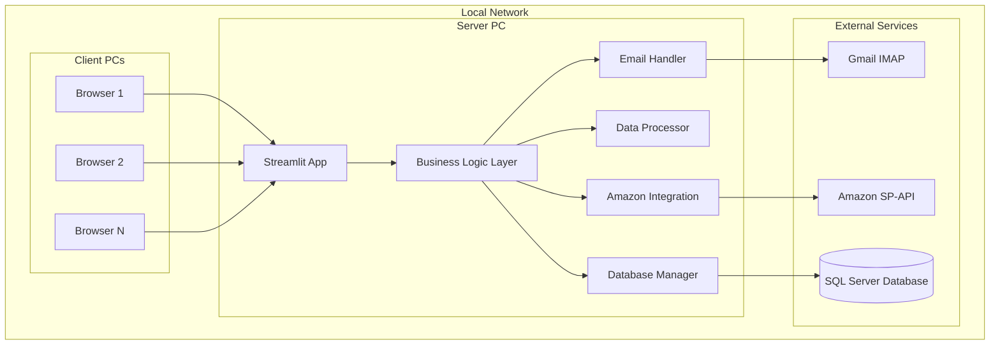

# Design Document

## Overview

The Streamlit migration will transform the existing PySide6 desktop application into a modern web-based inventory management system while simultaneously refactoring the monolithic codebase into a clean, modular architecture. The design leverages Streamlit's simplicity while improving code maintainability, testability, and extensibility. The architecture follows a single-server deployment model where one PC hosts the web application and all other PCs access it via web browsers.

## Architecture

### High-Level Architecture



### Component Architecture

The design will refactor the existing monolithic structure into clean, modular components:

- **Streamlit App Layer**: Web UI components and user interaction handling
- **Business Logic Layer**: Refactored inventory processing orchestration
- **Service Layer**: Modular services for email, database, Amazon API, and data processing
- **Configuration Layer**: Centralized configuration management
- **Data Layer**: Clean data models and processing utilities

### Refactored Module Structure

```
streamlit_inventory/
├── app.py                    # Main Streamlit application
├── pages/                    # Streamlit page modules
│   ├── dashboard.py
│   ├── inventory_update.py
│   ├── amazon_orders.py
│   └── sales_reports.py
├── services/                 # Business logic services
│   ├── inventory_service.py  # Orchestrates inventory updates
│   ├── email_service.py      # Email/IMAP operations
│   ├── database_service.py   # Database operations
│   ├── amazon_service.py     # Amazon SP-API integration
│   └── data_service.py       # Data processing utilities
├── models/                   # Data models and configurations
│   ├── config.py            # Configuration management
│   ├── supplier.py          # Supplier data models
│   └── inventory.py         # Inventory data models
└── utils/                    # Utility functions
    ├── logging.py           # Logging configuration
    └── helpers.py           # Common helper functions
```

## Components and Interfaces

### 1. Main Application (streamlit_app.py)

**Purpose**: Entry point and navigation hub
**Interface**:
```python
def main():
    st.set_page_config(page_title="Inventory Manager", layout="wide")
    
    # Navigation sidebar
    page = st.sidebar.selectbox("Select Function", [
        "Dashboard",
        "Inventory Update", 
        "Amazon Order Analysis",
        "Sales Reports"
    ])
    
    # Route to appropriate page
    if page == "Dashboard":
        show_dashboard()
    elif page == "Inventory Update":
        show_inventory_update()
    elif page == "Amazon Order Analysis":
        show_amazon_orders()
    elif page == "Sales Reports":
        show_sales_reports()
```

### 2. Inventory Update Module (pages/inventory_update.py)

**Purpose**: Supplier inventory processing and POS database updates
**Key Features**:
- Real-time progress tracking with st.progress()
- Email status indicators for each supplier
- Manual file upload fallback
- Database update confirmation

**Interface**:
```python
def show_inventory_update():
    st.title("Inventory Update")
    
    # Load supplier configurations
    config_manager = ConfigManager()
    suppliers = config_manager.get_supplier_configs()
    
    # Supplier selection checkboxes
    selected_suppliers = {}
    col1, col2, col3 = st.columns(3)
    for i, (code, supplier) in enumerate(suppliers.items()):
        col = [col1, col2, col3][i % 3]
        selected_suppliers[code] = col.checkbox(f"{supplier.name} ({code})", value=True)
    
    # Process button
    if st.button("Update Inventory", type="primary"):
        run_inventory_update(selected_suppliers)

def run_inventory_update(selected_suppliers):
    progress_bar = st.progress(0)
    status_container = st.container()
    
    # Use refactored inventory service
    inventory_service = InventoryService()
    
    # Run with progress callbacks
    def progress_callback(step, progress):
        status_container.info(step)
        progress_bar.progress(progress)
    
    inventory_service.update_inventory(selected_suppliers, progress_callback)
```

### 3. Refactored Services

#### A. Inventory Service (services/inventory_service.py)
**Purpose**: Orchestrates the entire inventory update process
```python
class InventoryService:
    def __init__(self):
        self.email_service = EmailService()
        self.data_service = DataService()
        self.database_service = DatabaseService()
        self.amazon_service = AmazonService()
    
    def update_inventory(self, selected_suppliers, progress_callback):
        """Main inventory update orchestration - refactored from Worker.run()"""
        total_steps = len(selected_suppliers) + 5  # suppliers + additional steps
        current_step = 0
        
        # Load base inventory
        progress_callback("Loading base inventory data", current_step / total_steps)
        all_inventory = self.data_service.load_base_inventory()
        current_step += 1
        
        # Process each supplier
        for supplier_code in selected_suppliers:
            progress_callback(f"Updating {supplier_code} inventory", current_step / total_steps)
            self._update_supplier_inventory(supplier_code, all_inventory)
            current_step += 1
        
        # Final processing steps
        progress_callback("Updating backorder items", current_step / total_steps)
        self._update_backorder_items(all_inventory)
        current_step += 1
        
        progress_callback("Updating POS database", current_step / total_steps)
        self.database_service.update_pos_inventory(all_inventory)
        current_step += 1
        
        progress_callback("Complete!", 1.0)
```

#### B. Email Service (services/email_service.py)
**Purpose**: Handle all email operations - refactored from individual update_XX() methods
```python
class EmailService:
    def __init__(self):
        self.config_manager = ConfigManager()
        self.gmail_auth = self.config_manager.get_gmail_auth()
    
    def download_supplier_files(self, supplier_code):
        """Download files for specific supplier - extracted from update_AL(), update_VF(), etc."""
        supplier_config = self.config_manager.get_supplier_config(supplier_code)
        
        # Connect to Gmail
        mail = imaplib.IMAP4_SSL('imap.gmail.com')
        mail.login(self.gmail_auth['username'], self.gmail_auth['password'])
        
        # Search for emails based on supplier configuration
        search_criteria = self._build_search_criteria(supplier_config)
        mail.select('inbox')
        result, data = mail.search(None, search_criteria)
        
        # Download attachments
        files = []
        for email_id in data[0].split():
            attachments = self._download_attachments(mail, email_id, supplier_code)
            files.extend(attachments)
        
        mail.close()
        mail.logout()
        
        return files
```

#### C. Data Service (services/data_service.py)
**Purpose**: Handle all data processing - refactored from scattered pandas operations
```python
class DataService:
    def load_base_inventory(self):
        """Load base inventory data - extracted from load_all_upc_inv()"""
        # Refactored logic from existing method
        pass
    
    def process_supplier_file(self, supplier_code, file_path):
        """Process supplier inventory file - standardized from various update methods"""
        supplier_config = ConfigManager().get_supplier_config(supplier_code)
        
        # Load file based on supplier format
        if supplier_config.file_format == 'excel':
            df = pd.read_excel(file_path, dtype=supplier_config.dtypes)
        elif supplier_config.file_format == 'csv':
            df = pd.read_csv(file_path, encoding=supplier_config.encoding)
        
        # Standardize column names
        df = self._standardize_columns(df, supplier_config.column_mapping)
        
        # Apply supplier-specific processing rules
        df = self._apply_processing_rules(df, supplier_config.processing_rules)
        
        return df
```

### 3. Amazon Order Analysis Module (pages/amazon_orders.py)

**Purpose**: Order analysis and inventory planning
**Key Features**:
- Order data visualization with filtering
- Stock level comparison tables
- Order form generation
- Historical order tracking

**Interface**:
```python
def show_amazon_orders():
    st.title("Amazon Order Analysis")
    
    # Date range selection
    col1, col2 = st.columns(2)
    date_from = col1.date_input("From Date", value=datetime.now() - timedelta(days=7))
    date_to = col2.date_input("To Date", value=datetime.now())
    
    # Fetch orders button
    if st.button("Fetch Amazon Orders"):
        fetch_and_display_orders(date_from, date_to)

@st.cache_data(ttl=300)
def fetch_amazon_orders(date_from, date_to):
    # Extract Amazon API logic from existing amazonOrderWindow.py
    with open('appdata/api_keys.json') as f:
        api_config = json.load(f)
    
    # Use existing SP-API code pattern from current files
    from sp_api.api import Orders
    orders_api = Orders(credentials=api_config['credentials'], refresh_token=api_config['refresh_token'])
    return orders_api.get_orders(CreatedAfter=date_from.isoformat())

def analyze_inventory_needs(orders_df, inventory_df):
    # Compare order quantities vs available stock
    # Generate reorder recommendations
    # Return analysis results
    pass
```

### 4. Sales Reports Module (pages/sales_reports.py)

**Purpose**: POS data analysis and reporting
**Key Features**:
- Date range selection
- Real-time report generation
- Excel download functionality
- Sales trend visualization

**Interface**:
```python
def show_sales_reports():
    st.title("Sales Reports")
    
    # Date selection
    date_from = st.date_input("From Date")
    date_to = st.date_input("To Date")
    
    if st.button("Generate Report"):
        generate_sales_report(date_from, date_to)

def generate_sales_report(date_from, date_to):
    progress_bar = st.progress(0)
    
    # Extract database logic from existing salesUpdateWindow.py Worker class
    with open('appdata/db_auth.json') as f:
        db_config = json.load(f)
    
    progress_bar.progress(25)
    
    # Use existing database connection pattern
    connection_string = f'DRIVER={{SQL Server}};SERVER={db_config["server"]};DATABASE={db_config["database"]};UID={db_config["username"]};PWD={db_config["password"]}'
    connection_url = URL.create("mssql+pyodbc", query={"odbc_connect": connection_string})
    engine = create_engine(connection_url)
    
    progress_bar.progress(75)
    
    # Extract SQL query from existing salesUpdateWindow.py
    sales_data = pd.read_sql(existing_sales_query, engine)
    
    progress_bar.progress(100)
    
    # Display results
    st.dataframe(report_df)
    
    # Download button
    excel_buffer = generate_excel_report(report_df)
    st.download_button(
        "Download Excel Report",
        excel_buffer,
        f"sales_report_{date_from}_{date_to}.xlsx"
    )
```

### 5. Dashboard Module (pages/dashboard.py)

**Purpose**: System status overview and quick actions
**Key Features**:
- Connection status indicators
- Recent activity summary
- Quick action buttons
- System health monitoring

**Interface**:
```python
def show_dashboard():
    st.title("Inventory Manager Dashboard")
    
    # System status cards
    col1, col2, col3, col4 = st.columns(4)
    
    with col1:
        show_database_status()
    with col2:
        show_email_status()
    with col3:
        show_amazon_api_status()
    with col4:
        show_last_update_info()
    
    # Recent activity
    st.subheader("Recent Activity")
    show_recent_activity()
    
    # Quick actions
    st.subheader("Quick Actions")
    if st.button("Quick Inventory Check"):
        run_quick_inventory_check()
```

## Data Models

### Session State Management

Streamlit's session state will manage user data and application state:

```python
# Initialize session state
if 'inventory_data' not in st.session_state:
    st.session_state.inventory_data = None

if 'amazon_orders' not in st.session_state:
    st.session_state.amazon_orders = None

if 'current_operation' not in st.session_state:
    st.session_state.current_operation = None
```

### Configuration Data Models

Refactored configuration management with structured data models:

```python
# models/config.py
@dataclass
class SupplierConfig:
    code: str
    name: str
    email_subject: str
    email_from: str
    file_format: str  # 'excel', 'csv'
    file_patterns: List[str]
    column_mapping: Dict[str, str]
    processing_rules: Dict[str, Any]
    dtypes: Dict[str, type] = None
    encoding: str = 'utf-8'

@dataclass
class DatabaseConfig:
    server: str
    database: str
    username: str
    password: str

@dataclass
class AmazonConfig:
    credentials: Dict[str, str]
    refresh_token: str
    marketplace: str = 'US'

class ConfigManager:
    """Centralized configuration management"""
    def __init__(self, root_path: str = ''):
        self.root_path = root_path
        self._load_configurations()
    
    def get_supplier_config(self, supplier_code: str) -> SupplierConfig:
        """Get configuration for specific supplier"""
        # Convert existing JSON configs to structured objects
        pass
    
    def get_database_config(self) -> DatabaseConfig:
        """Get database configuration"""
        with open(f'{self.root_path}appdata/db_auth.json') as f:
            config = json.load(f)
        return DatabaseConfig(**config)
    
    def get_amazon_config(self) -> AmazonConfig:
        """Get Amazon API configuration"""
        with open(f'{self.root_path}appdata/api_keys.json') as f:
            config = json.load(f)
        return AmazonConfig(**config)
```

### Data Processing Models

Refactored data models for better type safety and validation:

```python
# models/inventory.py
@dataclass
class InventoryItem:
    upc: str
    description: str
    supplier_code: str
    quantity: int
    last_updated: datetime
    
@dataclass
class SupplierInventory:
    supplier_code: str
    items: List[InventoryItem]
    last_sync: datetime
    
# models/supplier.py  
class SupplierProcessor:
    """Base class for supplier-specific processing"""
    def process_file(self, file_path: str) -> List[InventoryItem]:
        raise NotImplementedError
        
class AliciaProcessor(SupplierProcessor):
    """Processor for Alicia (AL) supplier files"""
    def process_file(self, file_path: str) -> List[InventoryItem]:
        # Refactored logic from update_AL()
        pass

class AmekorProcessor(SupplierProcessor):
    """Processor for Amekor (VF) supplier files"""  
    def process_file(self, file_path: str) -> List[InventoryItem]:
        # Refactored logic from update_VF()
        pass
```

### Data Processing Models

Extract and preserve existing data processing logic:
- Pandas DataFrames from current invUpdateWindow.py methods
- SQL queries from salesUpdateWindow.py Worker class
- Amazon SP-API calls from existing Worker.run() method
- Email/IMAP processing from current update_AL(), update_VF(), etc. methods

## Error Handling

### Graceful Degradation Strategy

1. **Email Service Failures**:
   - Display clear error messages
   - Provide manual file upload alternative
   - Cache last successful email fetch

2. **Database Connection Issues**:
   - Show connection status on dashboard
   - Retry logic with exponential backoff
   - Offline mode for read-only operations

3. **Amazon API Failures**:
   - Rate limiting handling
   - Fallback to cached data
   - Clear error messaging with retry options

4. **File Processing Errors**:
   - Individual file error isolation
   - Partial processing completion
   - Detailed error reporting per supplier

### Error Display Strategy

```python
def handle_error(error, context):
    """Centralized error handling for Streamlit UI"""
    if isinstance(error, DatabaseConnectionError):
        st.error("❌ Database connection failed. Please check network connectivity.")
        st.info("💡 Try refreshing the page or contact IT support.")
    elif isinstance(error, EmailAuthError):
        st.error("❌ Email authentication failed.")
        st.info("💡 You can upload files manually using the file uploader below.")
    elif isinstance(error, AmazonAPIError):
        st.error(f"❌ Amazon API error: {error.message}")
        st.info("💡 This may be temporary. Try again in a few minutes.")
    else:
        st.error(f"❌ Unexpected error in {context}: {str(error)}")
        st.info("💡 Please contact support if this persists.")
```

## Testing Strategy

### Unit Testing
- Test existing business logic modules (unchanged)
- Test new Streamlit page functions
- Mock external dependencies (database, APIs, email)

### Integration Testing
- End-to-end workflow testing
- Database connection testing
- API integration testing
- File processing pipeline testing

### User Acceptance Testing
- Cross-browser compatibility testing
- Network access testing from multiple PCs
- Performance testing with concurrent users
- Workflow validation against existing desktop app

### Deployment Testing
- Server startup and shutdown procedures
- Network connectivity validation
- Firewall configuration testing
- Backup and recovery procedures

## Performance Considerations

### Caching Strategy
```python
# Cache expensive operations
@st.cache_data(ttl=300)  # 5 minutes
def load_supplier_inventory():
    # Expensive data loading
    pass

@st.cache_resource
def get_database_connection():
    # Singleton database connection
    pass
```

### Concurrent User Handling
- Session state isolation
- Database connection pooling
- File processing queuing
- Resource cleanup on session end

### Network Optimization
- Minimize data transfer between server and clients
- Compress large datasets before display
- Implement pagination for large result sets
- Use progressive loading for long operations

## Security Considerations

### Network Security
- Internal network only (no external access)
- Standard HTTP acceptable for internal use
- Firewall rules for Streamlit port (8501)

### Data Security
- Existing credential files remain on server only
- No sensitive data transmitted to client browsers
- Session isolation between concurrent users
- Automatic session cleanup

### Access Control
- Network-based access control (internal IPs only)
- Optional: Simple password protection if needed
- Audit logging for user actions

## Deployment Architecture

### Server Requirements
- Windows PC with Python 3.8+
- Network connectivity to SQL Server
- Internet access for Gmail and Amazon APIs
- Sufficient RAM for concurrent users (8GB recommended)

### Installation Process
```bash
# Install dependencies
pip install streamlit pandas sqlalchemy pyodbc imaplib sp-api

# Run application
streamlit run streamlit_app.py --server.address 0.0.0.0 --server.port 8501
```

### Network Configuration
- Server PC IP: Static IP recommended
- Port 8501: Open for internal network access
- Client access: http://[server-ip]:8501
- No additional client-side installation required

This design maintains all existing functionality while providing a modern, accessible web interface that eliminates deployment complexity and Windows Defender issues.